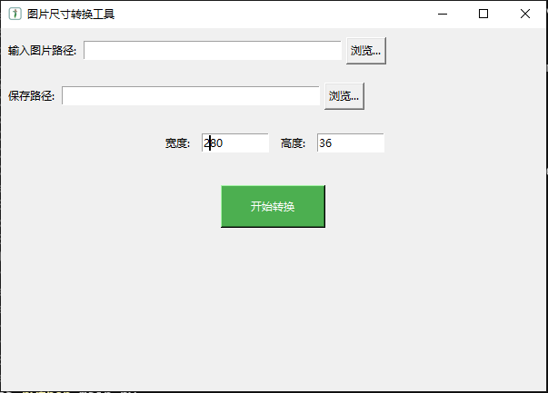

# 图片尺寸转换工具

这是一个使用 Python 和 Tkinter 构建的图片尺寸转换工具。用户可以选择输入图片文件，设置输出路径，并指定新的宽度和高度来调整图片尺寸。

## 功能

- 选择输入图片文件
- 设置输出路径
- 指定新的宽度和高度
- 预览图片
- 调整图片尺寸并保存

## 依赖

- Python 3.x
- OpenCV (`cv2`)
- Pillow (`PIL`)

## 安装

1. 克隆或下载此项目。
2. 安装所需的 Python 库：
    ```sh
    pip install opencv-python pillow
    ```

## 使用

1. 运行 `main.py` 文件：
    ```sh
    python main.py
    ```
2. 在应用程序中选择输入图片文件，设置输出路径，并指定新的宽度和高度。
3. 点击“开始转换”按钮来调整图片尺寸并保存。

## 截图



## 许可证

此项目使用 MIT 许可证。有关更多信息，请参阅 [LICENSE](LICENSE) 文件。